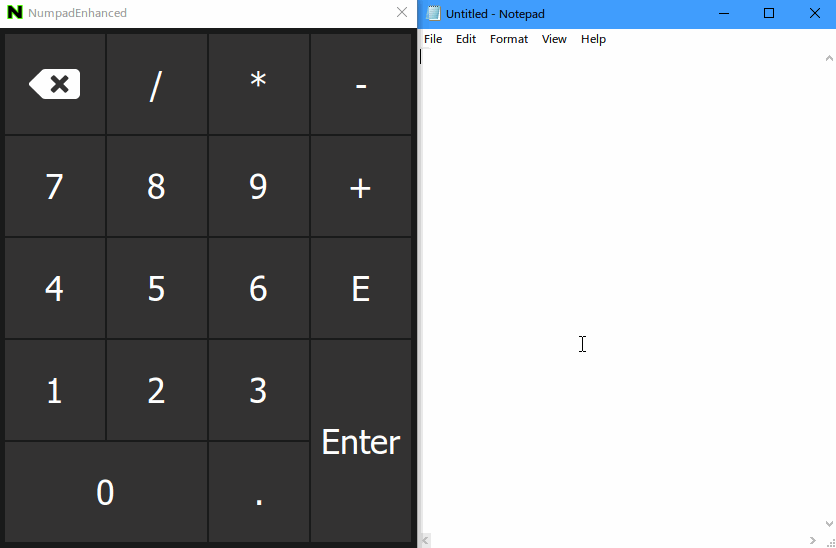

# NumpadEnhanced
[Fork of Numpad by abtimal on SourceForge](https://sourceforge.net/projects/numpad-emulator/)

# My Changes:
* Changed default color scheme to match the Windows 10 On-Screen Keyboard.
* Changed Button.h to inherit from QPushButton instead of QLabel and cleaned up related code
* Improved color theming options and simplified code (we don't need to save separate R, G, and B components when we can just save the QColor's .name() )
* Added visual indication for hovered and pressed buttons (All done purely by stylesheet now)
* Font and background colors for normal, hover, and pressed button pseudo-classes are all configurable via the settings UI
* Added an E button so inputting numbers of the format 1.24543E+32, etc can be easily input (E+n/E-n means  x10^n if you're wondering why I added this).
* Replace two-line backspace key with a SVG icon from fontawesome (added an SvgButton class that inherits  Button), and updated the About license page to include a link to the fontawesome license
* Updated About window to include my name, renamed project to NumpadEnhanced, so it's clear this is a fork and not an official release
* Various code cleanup

Any of the above changes, especially the E button, project name change, SvgButton, and about window changes should be trivial to leave out if this code is merged upstream.

I compiled with Qt 4.8.7 and MinGW 4.8.2
